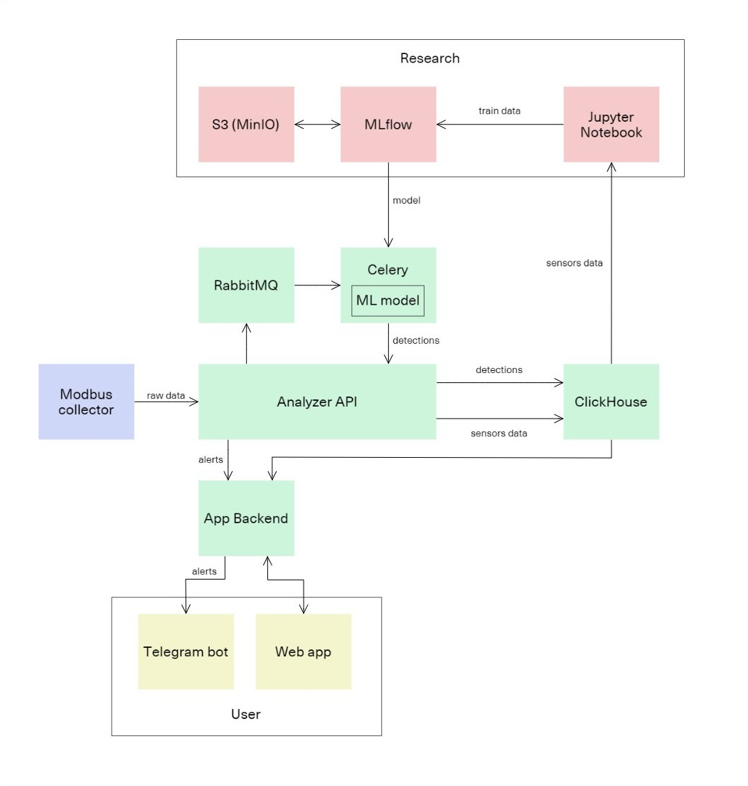

# 🔧 ML Uvelka

## 🏭 Предиктивное техническое обслуживание оборудования

> Интеллектуальная система анализа эксплуатации и выявления отклонений для снижения простоев оборудования и повышения эффективности ремонтов.

## 📌 Описание проекта  

- [ML system design документ проекта](docs/ml_system_design_doc.md)  

Добро пожаловать в проект ML Uvelka — платформу предиктивного технического обслуживания оборудования на базе машинного обучения.
Система автоматизирует сбор телеметрии, выявляет отклонения от нормального режима работы и уведомляет о возможных сбоях заранее, 
позволяя планировать техническое обслуживание рационально и своевременно.

## 🎯 Цели проекта

- ⚙️ **Автоматизация диагностики**: минимизация ручного труда и ошибок оператора.
- 📉 **Выявление аномалий**: обнаружение отклонений от нормальных режимов работы.
- 📆 **Оптимизация ТО**: сокращение числа незапланированных простоев и повышение срока службы агрегатов.

## ⚙️ Основные функции

- 🔔 Уведомления о необходимости обслуживания через Telegram-бот и веб-интерфейс.
- 🧠 Детекция аномалий с использованием ML-моделей (обучение с учителем и без).
- 📈 Визуализация сигналов, событий и состояния оборудования.
- 🛠 Настройка датчиков и управление журналами ТО через интерфейс.
- 👤 Разметка данных экспертами в интерактивном режиме.

## 🏗️ Архитектура решения

Система построена по микросервисной архитектуре с выделением облачных и локальных компонентов:

- `Modbus Collector` — локальный модуль опроса оборудования (Go).
- `Data Analyzer (FastAPI)` — точка приёма и маршрутизации данных.
- `ClickHouse` — хранилище показаний и событий.
- `Celery + RabbitMQ` — очередь и планировщик задач ML.
- `MLflow + MinIO` — управление жизненным циклом моделей.
- `Web App (Refine)` — визуализация, управление и настройка.
- `Telegram Bot (aiogram)` — уведомления и обратная связь.
- `Traefik` — балансировка нагрузки и единая точка входа.
- `Appwrite` — управление пользователями и настройками интерфейса.

## 📊 Технологии

| Компонент         | Технологии                  |
| ----------------- |-----------------------------|
| Языки             | Python, Go, TypeScript      |
| Хранилища         | ClickHouse, MinIO, MariaDB  |
| ML-инфраструктура | MLflow, DVC (опц.), Jupyter |
| Web UI            | React (Refine), Ant Design  |
| API и обработка   | FastAPI, Celery, RabbitMQ   |
| Безопасность      | Traefik, Appwrite (Auth)    |
| Развёртывание     | Docker, Docker Compose      |
  
## 🧪 Методология  

### 1. Постановка задачи

- Бизнес-цель: выявление потенциальных отказов до наступления поломки.
- Метрика успеха MVP: F1-score ≥ 0.85 по результатам валидации.

### 2. Подход

- Работа с временными рядами и статистическими признаками.
- Использование алгоритмов классификации для аномалий и регрессии для оценки RUL.
- Интеграция моделей в систему через асинхронную обработку (Celery).

### 3. Пилот

- Работа в паре с экспертом-оператором.
- Уведомления в реальном времени.
- Сравнение экспертных и модельных решений.

## 🔧 Внедрение

- Поддержка работы в изолированной промышленной сети.
- Лёгкое масштабирование через балансировку в Traefik.
- Полная автономность локального сбора данных при потере связи с облаком.
- Возможность дообучения моделей без остановки сервиса.
- Безопасность данных: шифрование и управление доступом.

## 🔗 Ссылка
- [ML модуль проекта](https://gitlab.com/mluvelka/celery)

Спасибо, что заинтересовались нашим проектом! 🚀
