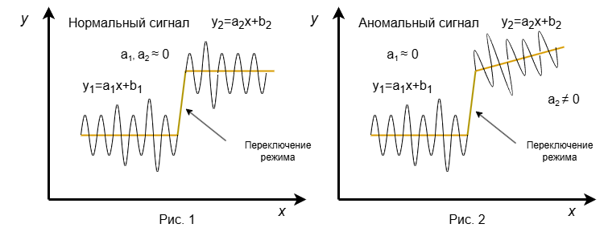
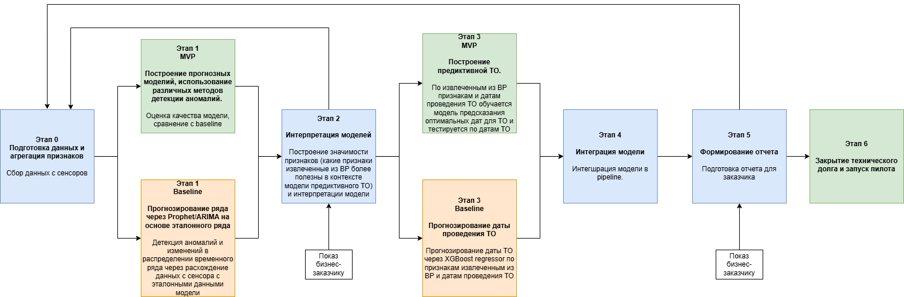
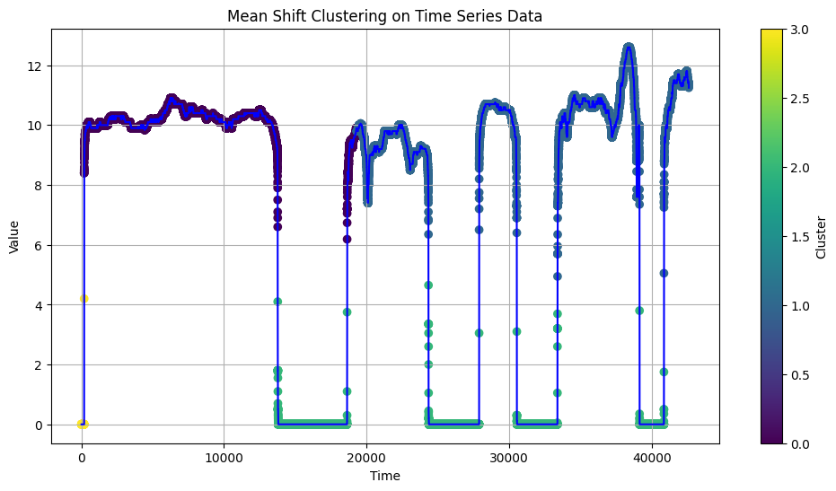
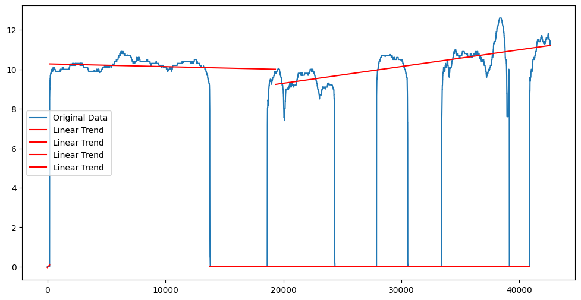
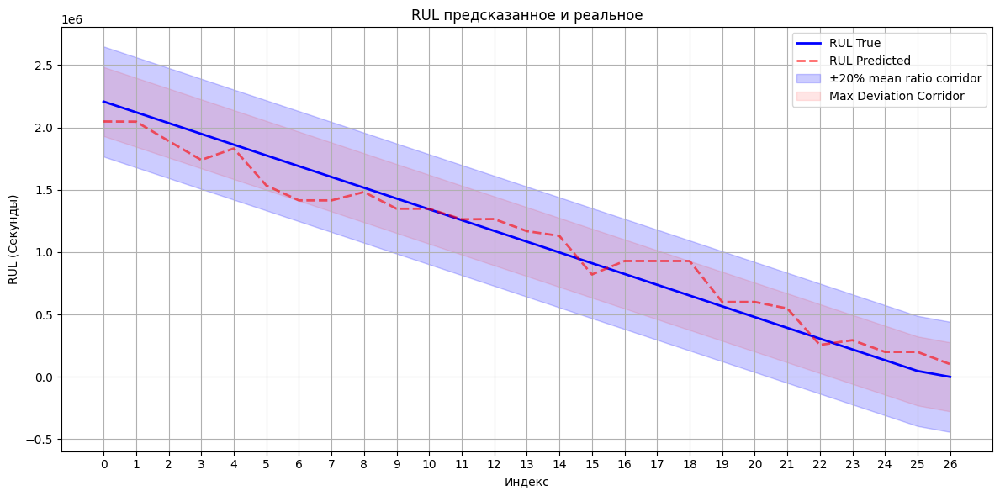
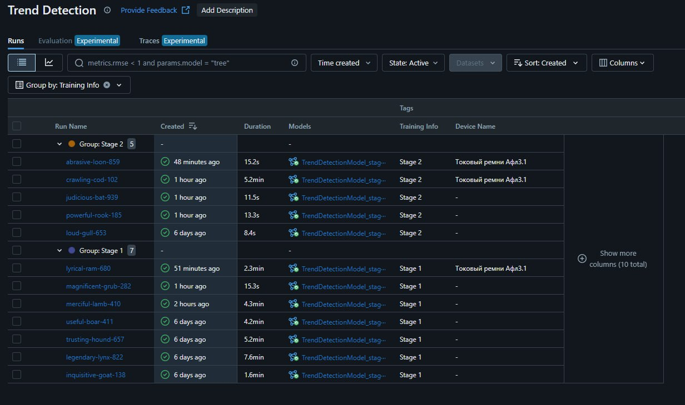
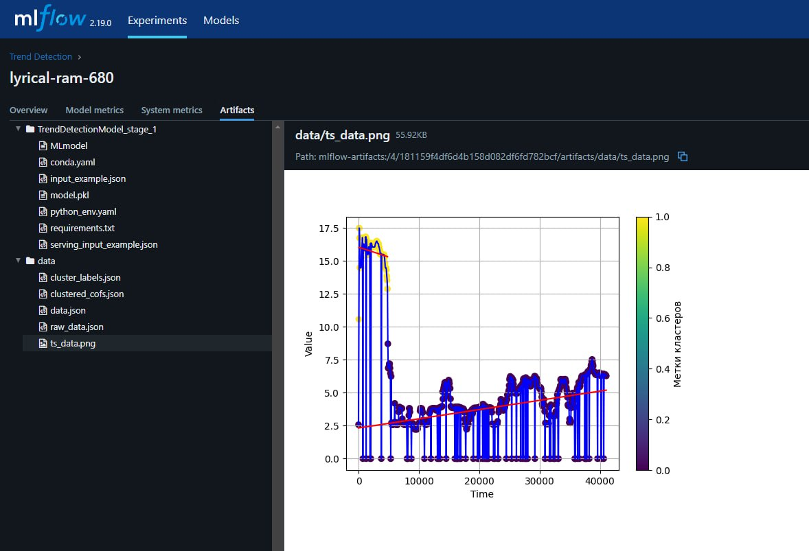

# ML System Design Doc - [RU]
## Дизайн ML системы - Система анализа эксплуатации оборудования с выявлением отклонений    

> ## Термины и пояснения  
> - Итерация - это все работы, которые совершаются до старта очередного пилота.    
> - БТ - бизнес-требования.  
> - EDA - Exploratory Data Analysis - исследовательский анализ данных.  
> - `Data Scientist` - `Data Scientist` совмещает в себе компетенции классического `Data Scientist` с упором на исследования и `ML Engineer` & `ML Ops` роли с акцентом на продуктивизацию моделей.  
> - `Product Owner` - заказчик.  
> - ТО - техническое обслуживание оборудования.  
> - Предиктивное ТО - Предиктивное техническое обслуживание - комплексный подход, позволяющий определить состояние находящегося в эксплуатации оборудования и оценить, когда следует провести техническое обслуживание.  
> - ML -  Машинное обучение.  
> - ВР - временной ряд, в контексте данной задачи сигнал снятый с сенсора.   
> - ЛР - линейная регрессия.
> - PLC - (Programmable logic controller) программируемый логический контроллер  

### 1. Цели и предпосылки  
#### 1.1. Зачем идем в разработку продукта?  

- Бизнес-цель: заключается в автоматизации процесса диагностики состояния машин и оборудования производителя круп «Увелка» в онлайн-режиме с целью выявления отклонений от номинальных режимов работы и своевременного уведомления о необходимости проведения технического обслуживания оборудования.  
- Почему станет лучше, чем сейчас, от использования ML: может помочь в более точном прогнозировании состояния оборудования, выявлении скрытых закономерностей в данных, автоматизации анализа больших объемов информации, а также в улучшении точности и скорости диагностики, что в свою очередь может снизить количество непредвиденных поломок и оптимизировать график обслуживания.  
- Что будем считать успехом итерации с точки зрения бизнеса: получение MVP системы по аналитике состояния оборудования и уведомлению об отклонениях и необходимости проведения технического обслуживания.
    - Модель должна достаточно хорошо обнаруживать аномалии - Recall > 80% (пропуск неполадок), не менее важно, чтобы нормальное показатели не были отнесены к аномальным - Precision > 70% (лишнее срабатывание), как среднее гармоническое f1 между первыми двумя планируется использовать с показателем > 80%.
    - Сервис будет извещать работника предприятия о аномальном сигнале, например в телеграмме или через домен приложения.

#### 1.2. Бизнес-требования и ограничения  

- Краткое описание БТ и ссылки на детальные документы с бизнес-требованиями:  
  1. Модель должна, на основе собранных данных с сенсоров оборудования за длительность текущей смены (конкретная, достаточная для вывода о сигнале, длительность будет вычисляться), оповещать о необходимости проведения технического обслуживания.  
  2. Наличие самостоятельного хостинга или развертывание проекта на локальной машине.  
- Бизнес-ограничения: на данной итерации конкретные ограничения от `Product Owner` ещё не сформированы.  
- Что мы ожидаем от конкретной итерации: решение задачи детекции аномального сигнала Recall > 80%, Precision > 70%, f1 > 80%.  
- Описание бизнес-процесса пилота: сервис будет оповещать инженеров, через телеграм оповещение и через меню на домене сервиса (web приложение), о аномальном сигнале и о необходимости проведения технического обслуживания для конкретной единицы оборудования.  
- Что считаем успешным пилотом? Критерии успеха и возможные пути развития проекта: предиктивное ТО успешно справляется с детекцией аномального поведения сигнала (Recall > 80%, Precision > 70%, f1 > 80%) и с составлением графика проведения технических работ.

#### 1.3. Что входит в скоуп проекта/итерации, что не входит   

- На закрытие каких БТ подписываемся в данной итерации: сервис (web приложение), которое по снятому сигналу с датчиков (достаточная длительность для вывода о аномальности сигнала будет определена для каждого устройства в будущем) обнаруживает неисправность оборудования и оповещает работников предприятия.
- Что не будет закрыто: пока нет описания состояния оборудования для конкретного временного периода (причины остановки оборудования, зафиксированные неисправности), поэтому нет возможности сделать предиктивное ТО.
- Описание результата с точки зрения качества кода и воспроизводимости решения: микросервисная архитектура с возможностью развертывания через Doker, а также сами модели детекции в виде .py скриптов.  
- Описание планируемого технического долга (что оставляем для дальнейшей продуктивизации): модель, которая на основе собранных за определенный период данных делает прогноз о дате проведения ТО.

#### 1.4. Предпосылки решения  

- Описание всех общих предпосылок решения, используемых в системе – с обоснованием от запроса бизнеса: какие блоки данных используем, горизонт прогноза, гранулярность модели, и др. `Data Scientist`:  
 1. Блоки данных  
    - Данные о состоянии оборудования  
       - Датчики и показания: Данные, собранные с помощью сенсоров (температура, давление, вибрация и т.д.), играют ключевую роль в оценке технического состояния оборудования.  
       - История неполадок: Записи о предыдущих авариях, ремонтах и осмотрах, которые могут помочь в выявлении паттернов и трендов.  
    - Оперативные данные  
       - Рабочие условия: Информация о нагрузке на оборудование, циклах работы и прерываниях будет способствовать более точному прогнозированию состояний.    
2. Горизонт прогноза (пока что не определен, так как пока нет данных необходимых для определения временных периодов)  
    - Краткосрочный прогноз (1 час; пока что примерно): Используется для оперативного обнаружения неисправностей в оборудовании.
    - Среднесрочный прогноз (внутри 1 месяца): Используется для прогнозирования ТО. Сейчас плановые ТО каждый месяц.
3. Гранулярность модели
    - Уровень агрегирования: Данные могут агрегироваться на уровне отдельного оборудования или группы оборудования, какой вариант лучше будет выясняться дальше через тестирование и консультацию с инженерами.
    - Частота обновления данных: Модель может использовать данные в реальном времени или обновляться на основе заданного графика (например, ежедневно, еженедельно).
4. Обоснование от запроса бизнеса
    - Уменьшение простоев: Бизнес-потребность в минимизации времени простоя оборудования требует точных прогнозов о его состоянии и возможных сбоях.
    - Оптимизация затрат: Понимание, когда и какое оборудование потребует обслуживания, помогает минимизировать внеплановые ремонты и оптимизировать запасы запчастей.
    - Повышение надежности: Системы предиктивного ТО должны быть интегрированы в общую стратегию повышения надежности и долговечности оборудования.
    - Устойчивость к изменениям: Способность адаптироваться к изменениям в производственных условиях или в самом оборудовании требует гибкой модели, способной учитывать новые данные.

### 2. Методология `Data Scientist`     

#### 2.1. Постановка задачи  
  
На рисунке 1 представлен нормальный сигнал с переключением режима (сменой конфигурации оборудования).  
На рисунке 2 представлен аномальный сигнал, где после переключения сигнала появился тренд.  

- Что делаем с технической точки зрения: определяем статична ли амплитуда периодического сигнала за текущее время работы (от начала смены до времени проверки, вплоть до конца - 12 часов) для любой конфигурации оборудования (конфигурация очень часто меняется и для каждой конфигурации величина амплитуды будет своя) (Change point detection).
- Со временем оборудование изнашивается и для одной и той же конфигурации оборудования амплитуда будет постепенно увеличиваться (в пределах одной смены амплитуда статична, но в бОльших пределах маленький тренд будет заметен) - это нужно отслеживать и при достижении некоторого порога (будет вычисляться экспериментально) извещать работника предприятия (remaining useful life prediction).

#### 2.2. Блок-схема решения    
  

#### 2.3. Подготовка данных
[EDA на небольших данных](../DA/EDA/EDA.ipynb)  
[EDA на больших данных](../DA/EDA/EDA_v2.ipynb)  
[Идеи и подходы к решению задачи, примеры использования baseline](../DA/EDA/AnomalyDetection_v3.ipynb)  
- Описание данных/сущностей: с регистров датчиков считываются показатели (4 раза в минуту, работаем над тем, чтобы повысить частоту), которые затем отправляются на сервер для обработки. Описание данных:

Пример данных:
 
| Timestamp           | Device                     | Amperage    |
|---------------------|----------------------------|-------------|
| 2024-12-01 0:00:01  | Токовый ремни Афл3.2      | 16.304153   |
| 2024-12-01 0:00:02  | Токовый ремни Афл3.3      | 3.9494066   |
| 2024-12-01 0:00:03  | Токовый нипроллер Афл3.3  | 0           |
| 2024-12-01 0:00:04  | Токовый губки Афл3.3      | 0           |
| 2024-12-01 0:00:05  | Токовый нипроллер Афл3.4  | 0           |
| 2024-12-01 0:00:06  | Токовый ремни Афл3.4      | 0           |
| 2024-12-01 0:00:08  | Токовый губки Афл3.4      | 0           |   

    - Timestamp : 2024-12-01 0:00:01 : timestamp
    - Device : Токовый <ремни, губки, нипроллер> Афл3.<1...5>.Максим RMS : string  
    - Amperage : [0..30] : float32  
- Есть ли выявленные проблемы с объемом/качеством/разметкой? Для составления гипотез по данным используются данные выгруженные из scada системы, так как данных набранных через наш ETL ещё не так много набралось.  
    - Объем данных: набрано за 4 месяца  
    - Пропусков в данных: 12% - не очень критично, обновили pipeline сбора данных, сейчас пропусков нет.  
    - Разметка релевантная для задачи предсказания аномалий данных отсутствует.  
- Какие риски и проблемы были выявлены на этапе EDA?  
    - Основная проблема отсутствие разметки: по какой причине происходила остановка оборудования, в какие моменты происходила замена оборудования (замена конфигурации оборудования)
- Необходимый результат этапа: все кроме разметки есть, потребуется создать собственную разметку, с привлечением эксперта из предметной области.  

#### 2.4. Подготовка прогнозных моделей  
- Описание ML-метрик и функций потерь, выбранные для решения задачи с обоснованием этого выбора.  
    - F1 Score: Гармоническое среднее между Recall и Precision. Целевое значение: > 80%. Выбрана f1 потому, что нужен баланс между Recall и Precision: важно чтобы модель не пропускала аномалии, но и не отмечала нормальные данные как аномалии.  
    - Функция потерь baseline: критерий Джини в DecisionTreeClassifier (глубина=1, «пень»). Модель подбирает пороговое значение коэффициента наклона alpha, выше которого сегмент классифицируется как аномальный. Так же идет подбор порога и для других статистик.
    - Основные модели:  
        - LightGBMClassifier — классификация аномалий, функция потерь — Log loss.
        - XGBoostRegressor — прогнозирование Remaining Useful Life (RUL), функция потерь — MSE.
    - Методы без учителя: Local Outlier Factor (LOF) для поиска аномалий без разметки, что позволяет использовать данные в условиях недостатка экспертных меток.
    - Для оценки износа оборудования со временем применяется метод detect_stats_drift: сравнение распределений статистик за разные периоды времени с помощью теста Колмогорова–Смирнова (ks_2samp). Это позволяет вовремя обнаружить изменение условий эксплуатации или дрейф данных.
- Описание схемы ML-валидации, с учетом специфики состава данных, бизнес-задачи, функциональных и нефункциональных требований.  
    - Стратифицированная кросс-валидация (k=5).  
    - Разделение на train/val/test: 60/20/20.  
    - Для RUL дополнительно проводится временная валидация (train на прошлых интервалах, test на более новых).  
- Описание структуры бейзлайна (одного или нескольких), предобработки и процесса моделирования для бейзлайна.  
    - В модель поступает ВР (например за смену = 12 часов ~ 42000 записей).  
        -  Данные можно сгладить скользящим окном по медиане (наиболее устойчива к выбросам).  
        -  Данные можно уменьшить в количестве (downsampling), что существенно ускорит процесс обучения.  
        -  Важно чтобы тестовые данные тоже были обработаны аналогично тренировочным.  
    - Модель кластеризирует ВР на сегменты, пример:  

Эти сегменты (резкие скачки среднего значения ВР) возникают в результате изменений конфигураций в оборудовании предметной области (переключения режимов, эти изменения нигде в самом производстве не фиксируются, поэтому требуется такая обработка на сегменты)

    - Для полученных кластеров строятся линейные регрессии, из которых извлекается наклон и свободная константа (slope, intercept) и прочие статистики, пример:  

    - Затем, извлеченные статистики отправляются в:
        - Модуль детекции аномалий. Сегментированные данные достаточно просто разметить эксперту из предметной области и связать их с извлеченными статистиками. Получив метки аномальных (1) и не аномальных (0) наклонов, модель использует критерий Джини для поиска оптимального порога наклона, выше которого наблюдения помечаются как аномальные (1). Пример:  

            | Segment_id           | Anomaly                     |
            |---------------------|----------------------------|
            | 214  | 0      |
            | 215  | 1      |  

        - Модуль предиктивного ТО. Прогнозирование оставшегося времени работы оборудования осуществляется за счет объединения статистик и журнала событий, реализованного в нашем сервисе, с периодами работ оборудования. Из полученного объединения предсказывается оставшееся время работы оборудования (RUL). Пример работы модели на тестовом периоде:
        
    - [Реализация baseline](../baseline/TrendDetectionUnsupervised.py)
- Стратегии дальнейшего развития решения.  
    - Расширение признакового пространства (статистики связанные с частотностью сигнала).
    - XGBoost для RUL с учетом динамики признаков.
    - Автоматическая оптимизация гиперпараметров (Optuna).
- Анализ и интерпретация работы модели
    - С датчиков поступает RMS ток (так как исходный ток имеет пилообразную форму, то RMS = CurrentAmplitude/sqrt(3)), в теории он для одного и того же режима должен быть постоянен, но из-за специфики снятия данных есть небольшое отклонение от теоретического сигнала. Если оборудование начинает выходить из строя, то амплитуда начинает расти, следовательно и RMS, отсюда и рост тренда, которые данная модель должна улавливать и оповещать.
    - LightGBM классифицирует аномалии по совокупности статистик.
    - XGBoost прогнозирует RUL на основе трендов.
    - Drift detection (KS-test) позволяет выявлять, что новые данные начинают отличаться от исторических — например, при износе оборудования.
- Риски данного этапа, и способы их снижения  
    - Недостаток данных для RUL → использовать данные аналогичных предприятий (transfer learning).
    - Риск ложных срабатываний → комбинация моделей с учителем и без учителя.
    - Изменение распределения сигналов → автоматическая проверка на дрейф данных и переобучение моделей.
- Необходимый результат этапа  
    - Классификация сигналов на аномальные и нормальные.
    - Прогнозирование RUL.
    - Снижение внеплановых простоев оборудования на 20–30%.

### 3. Подготовка пилота    
[Обучение и валидация модели](../DA/Validation/TrendDetectionValiadation.ipynb)

#### 3.1. Способ оценки пилота  
- Для оценки пилота, сервис на 1-3 месяца будет работать параллельно вместе с экспертом (затем сервис в автономном режиме будет вычислять аномалии). Эксперт будет отмечать аномальные сигналы, а модель запоминать их характеристики и подстраиваться. Оценка эффективности будет проводиться на основе следующих параметров:  
    - Точность обнаружения аномалий  
    - Количество ложных срабатываний  
    - Скорость обнаружения  
    - Удовлетворенность работников предприятия
**Метод оценки** точности обнаружения аномалий и количества ложных срабатываний - Recall, Precision
#### 3.2. Что считаем успешным пилотом    
- Пилот считается успешным, если достигнуты следующие показатели качества  
    - f1 > 0.8  
    - Сокращенное время, которое затрачивает работник предприятия на мониторинг оборудования  
#### 3.3. Подготовка пилота  
- Устройство для считывания: Для работы пилота требуется непосредственное подключение устройства к PLC. На устройстве должно быть от 1гб оперативной памяти и установлен PyModbus==3.8.3 и выше.
- Обработка данных в сервисе: Без сжатия ВР на сигнал с одного датчика, собранного за 24 часа, уходит 18 минут, при сжатии ВР - 14-18 секунд. Всего на данный момент 18 датчиков. База данных и её объем зависит от предпочтений бизнеса и требуемого количества хранимых данных.
- Основные требования к железу относятся к ClickHouse: От 2 гб оперативной памяти, от CPU - 2.4 ГГц, требуемое пространство на диске зависит от потребностей заказчика, 60 гб хватает на 1+ год непрерывной работы.
- Дообучение модели: В случае обновления оборудования, будет произведена дополнительная разметка данных за счет экспертов, через интерфейс сервиса: данные будут разбиты на большие сегменты, которые легко разметить эксперту, затем на этих размеченных данных будет производится дообучеине моделей.
- Замена моделий автоматизировано и производится через celery.

### 4. Внедрение  
[Код API сервиса](https://gitlab.com/mluvelka)  
[Код инференса через Celery](https://gitlab.com/mluvelka/celery)  
Несколько пробных ранов в MLflow по двум этапам:  
 
Разметка сегментов (нормальные/аномальные)
 
#### 4.1. Архитектура решения  
  
- Modbus Collector: Модуль сбора данных с датчиков.  
- Data Analyzer: API для получения данных с датчиков и последующей обработки.  
- Traefik: Прокси для управления доступом к сервисам ML Uvelka. Осуществляет балансировку нагрузки и сокрытие структуры внутренней сети.  
- ClickHouse Database: База для хранения показаний датчиков.  
- MinIO: S3 хранилище для моделей и артефактов.  
- MLflow: Платформа для управления сквозным жизненным циклом машинного обучения.  
- Web App: Веб-приложение для мониторинга и анализа данных с датчиков.
Основным бутылочным горлышком системы является celery, так как именно на него приходится основной поток данных для обработки.
Микросервисная архитектура - любой сервис можно легко промасштабировать, добавить балансировщик, уже используется traefik.
#### 4.2. Описание инфраструктуры и масштабируемости  
Инфраструктура решения будет построена на облачной платформе с использованием контейнеризации и оркестрации для обеспечения масштабируемости и эластичности.  
- CI/CD  
- MLflow  
- Docker  
#### 4.3. Требования к работе системы  
- Отказоустойчивость: Система будет обеспечивать высокий уровень доступности, с минимальным временем восстановления (RTO) менее 1 часа и максимально допустимым временем простоя (RPO) не более 1 часа. Реализация нескольких уровней резервирования и механизмов автоматического восстановления позволит минимизировать влияние сбоев на работу системы. 
- Автономность: Система нацелена на то чтобы минимизировать затраты времени работника предприятия на мониторинг состояния оборудования.
- Доступность: Минимально приемлемая доступность системы должна составлять 99.9%.
- Система должна обеспечивать время отклика на запросы не более 1-2 секунд.
#### 4.4. Безопасность данных  
Внедрение системы будет включать строгие меры безопасности для защиты данных пользователей и обеспечения соответствия нормативным требованиям, таким как GDPR. В том числе и на уровне сбора данных с PLC, что обеспечивает протокол Modbus.  
- Шифрование данных: Все данные, передаваемые и хранимые системой, будут зашифрованы.  
- Управление доступом: Строгая политика управления доступом для предотвращения неавторизованного доступа к информации.  
#### 4.5. Риски  
- Масштабирование: Проектирование архитектуры системы с учетом возможности легкого горизонтального масштабирования для поддержания высокой производительности при росте пользовательской базы.  
- API сервис: Разработка резервных методов взаимодействия с данными на случай изменения условий работы сторонних API.
- Отключение оборудования, с которого считывается сигнал: В случае отключения оборудования, с которого считывается сигнал, данные сохраняются в базе данных, и модель будет учитывать последние сохраненные данные, обеспечивая непрерывность бизнес-процессов  

#### 4.6. Нагрузочное тестирование
Было проведено тестирование с увеличением количества пользователей с 0 до 100 (запрос раз в 3-5 секунд), что является вполне реалистичным для предприятия, для которого разрабатывается сервис.  
Конфиг системы: 4 x 3.3 ГГц CPU - 8 ГБ RAM  - 80 ГБ NVMe  
  
